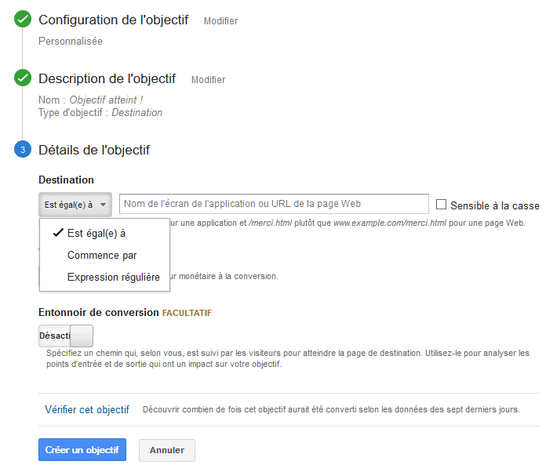
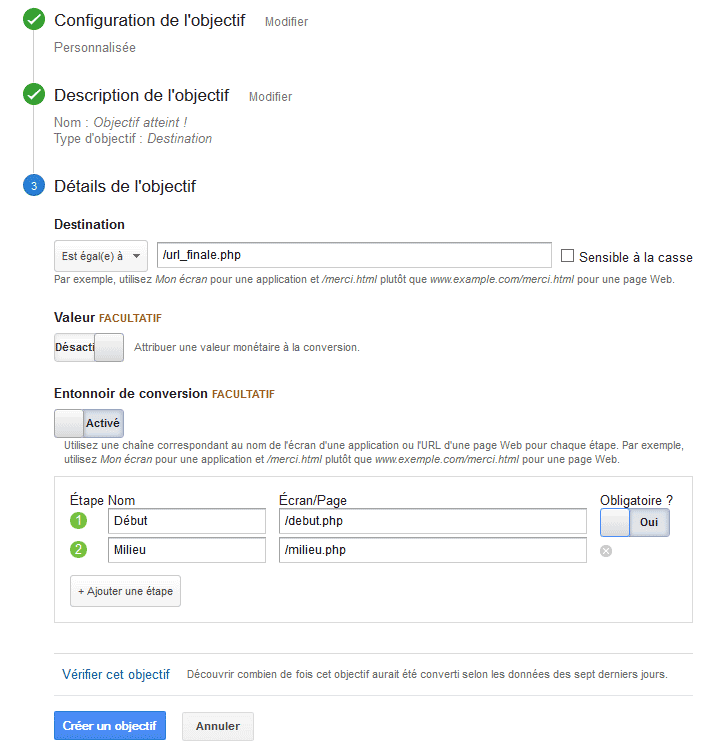
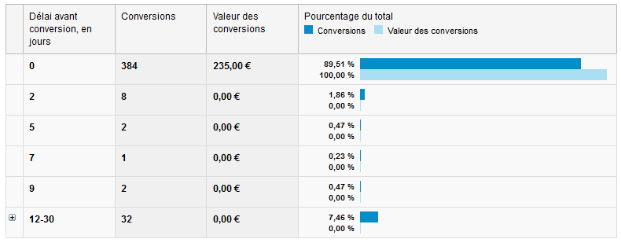

# Universal Analytics&#160;: brouillon

## Introduction

Depuis début Avril 2014, Google Analytics a mué en <em lang="en">Google <strong>Universal</strong> Analytics</em>. Comme son nom l’indique, cet outil a été
pensé pour devenir une solution analytique universelle, comprenez qu’elle est capable de discuter autant avec un <abbr title="Customer Relationship Management" lang="en">CRM</abbr>, une application mobile, un site Web, etc. 

Comme l’indique <a href="https://support.google.com/analytics/answer/2790010?hl=fr">la présentation de Google Universal Analytics</a>, il y a&#160;:

<ul>
	<li>la bibliothèque JavaScript <code>analytics.js</code> pour les sites Web&#8239;;</li>
	<li>les <abbr title="Software Development Kit" lang="en">SDK</abbr> Google Analytics pour les applications pour mobile&#8239;;</li>
	<li>et le protocole de mesure pour les autres appareils numériques.</li>
</ul>

L’idée est d’ailleurs de permettre de matcher ces données pour analyser les comportements, typiquement sur une interface multi-écrans (une application mobile
qui a sa version web, etc.). Autant le dire de suite, ce genre de sport est une science complète et complexe, qui nécessite de grandes connaissances qui dépassent
de loin l’analyse d’un site internet (et je serais bien incapable de vous guider sur ce sujet).

Quoi qu’il en soit, l’interface a beaucoup évolué, «&#160;comme d’habitude avec les produits Google&#160;» serait-on tenté d’ajouter, surtout si vous n’êtes pas coutumier de cet outil.
Bigre&#8239;! Peut-être aviez-vous lu l’article <a href="http://letrainde13h37.fr/38/connaitre-efficacite-site-via-google-analytics/">Connaître l’efficacité d’un site via <i lang="en">Google Analytics</i></a>
ici même, et vous vous dites que ces belles connaissances durement acquises –&#160;enfin pas trop j’espère&#160;– sont désormais obsolètes&#8239;?

Hé bien, j’ai une bonne et une mauvaise nouvelle. La mauvaise, c’est qu’effectivement <strong>beaucoup de choses ont changé</strong> (syntaxe, interface, méthologie pratique, etc.).
La bonne, c’est que <strong>tous les principes expliqués dans le précédent article… sont toujours valables</strong>, et je dirais même plus que jamais. C’était même plus dur avant. 

Je vous propose donc une mise à jour de l’article précédent, suivi de quelques considérations tirées de mon expérience.

<h2>Les «&#160;nouvelles&#160;» bases</h2>

<h3>Le code de suivi</h3>

Le code a évolué, en voici un exemple&#160;: 

<pre><code>&lt;script&gt;
  (function(i,s,o,g,r,a,m){i['GoogleAnalyticsObject']=r;i[r]=i[r]||function(){
  (i[r].q=i[r].q||[]).push(arguments)},i[r].l=1*new Date();a=s.createElement(o),
  m=s.getElementsByTagName(o)[0];a.async=1;a.src=g;m.parentNode.insertBefore(a,m)
  })(window,document,'script','//www.google-analytics.com/analytics.js','ga');

  ga('create', 'UA-XXXXXXX-x', 'auto');
  ga('send', 'pageview');

&lt;/script&gt;</code></pre>

Hormis la syntaxe, rien de bien neuf sous le soleil&#160;: à insérer dans le <code>head</code> de votre page, en remplaçant bien sûr le numéro de compte (UA-XXXXXXX-X) par celui
qui vous sera donné. Une fois mis en place sur vos différentes pages, il les trackera selon leur URL.

<h3>Le suivi de page virtuelle</h3>

Le <i lang="en">Virtual Page Tracker</i> consiste toujours à spécifier la valeur que vous souhaitez faire remonter via <code>ga(’send’, ’pageview’);</code>, exemple&#160;:

<pre><code>ga(’send’, ’pageview’, ’/mapage-virtuelle.php’);</code></pre>

Comme avant, cette possibilité très puissante va permettre de construire des <abbr title="Uniform Resource Locator" lang="en">URL</abbr>s à votre convenance, lesquelles pourront alors être suivies et classées.

<h3>Suivi d'événement</h3>

Il est toujours possible de suivre un événement sur une page (un clic, une action de l’utilisateur, etc.) grâce aux <i lang="en">Event Trackers</i>.

<pre><code>ga('send', 'event', 'category', 'action', 'label', 'value' );</code></pre>

Le paramètre <code>value</code> est facultatif, ce qui nous donne pour un clic sur un <i lang="en">mailto</i>&#160;:

<pre><code>&lt;a href="mailto:tchoutchou@letrainde13h37.fr" onclick="ga('send', 'event', 'email', 'click', 'tchoutchou@letrainde13h37.fr' );"&gt;contacter Le Train&lt;/a&gt;</code></pre>

<h2>Mise en place d’objectifs sous Universal Analytics</h2>

Les objectifs sont toujours de la partie, et sont même de plus en plus critiques (comprenez par là qu’<i lang="en">Universal Analytics</i> sans objectifs n’a que peu d’intérêt). L’idée est surtout d’étudier non pas le nombres de visites (qui ne révèle rien) mais bien le <strong>comportement</strong> de ceux qui remplissent les objectifs&#160;: même avec une mise en place simple, on peut déjà étudier et comprendre des choses. 

Typiquement, une approche marketing d’un site internet consiste à étudier le comportement de ceux qui «&#160;convertissent&#160;» (qui effectuent des conversions = qui remplissent les
objectifs) et à <strong>comprendre ce qui les amène à convertir</strong>. Les industries du luxe l’ont par exemple très bien compris&#160;: le but n’est pas de vendre une montre ou
une voiture hors de prix à n’importe qui (passé un certain nombre de zéros, vous vous doutez bien que le nombre de clients potentiels se réduit drastiquement), mais bien de comprendre
ceux qui viennent acheter (comment ils sont venus, quel parcours, ce qui les a motivés, etc.). Car plus le marché se restreint, plus une conversion est difficile à faire.

Même si votre site n’est pas à proprement parler dans le domaine du luxe, il est toujours délicat de savoir ce qui a motivé une conversion (vous n’avez pas le client devant vous)&#160;:
une publicité&#8239;? Un <em lang="en">funnel</em> (entonnoir) efficace&#8239;? Des annonces de type <abbr title="Cost Per Click" lang="en">CPC</abbr> (comme Adwords)&#8239;? Les réseaux sociaux&#8239;? Ou même une combinaison de plusieurs canaux&#8239;?

Les objectifs doivent être mis en place pour répondre à ces questions (et à d’autres…).

<h3>Objectifs simples</h3>

Maintenant, c’est sous "Admin", "Vue", "Objectifs".

Comme vous pouvez le voir, l’interface propose des exemples et un début de classification. Libre à vous de vous baser dessus ou non, pour cet exemple, j’ai pris le choix personnalisé.

Une fois votre objectif nommé en étape 2 (là j’ai pris une page de destination), vous arrivez sur une étape plutôt familière. Le principe est exactement le même que précédemment&#160;:
vous pouvez indiquer une valeur, vous pouvez choisir si c’est une simple correspondance à une <abbr title="Universal Ressource Locator" lang="en">URL</abbr> ou une expression régulière, etc.

<h3>Entonnoirs</h3>

Toujours au moment de créer l’objectif, vous pouvez indiquer si plusieurs étapes sont possibles. Il vous suffit d’activer l’option «&#160;entonnoir de conversion&#160;», et de spécifier
les étapes, l’objectif étant la dernière.

Si besoin est, vous pouvez indiquer une valeur, si certaines étapes sont obligatoires ou non, etc. Encore une fois, c’est exactement le même principe que sur la précédente version.

Note&#160;: je ne reviens pas sur le chiffrage du Retour sur Investissement d’une campagne donné dans
<a href="http://letrainde13h37.fr/38/connaitre-efficacite-site-via-google-analytics/">le premier article sur <i lang="en">Google Analytics</i></a>, la logique est exactement la même.

<h2>Des outils plus pratiques</h2>

Si l’interface précédente de <i lang="en">Google Analytics</i> était quelque peu austère pour la création d’objectifs, elle donne dorénavant de nombreux exemples comme vous avez pu le voir avec une des images
ci-dessus.

Côté tests, une fois que vous avez créé votre objectif, <i lang="en">Universal Analytics</i> vous permet de vérifier si cet objectif aurait été converti durant la dernière semaine. C’est pratique si
vous avez oublié de les créer avant de lancer le site.

Si avant tester un objectif était quelque peu laborieux, avec l’onglet «&#160;Temps réel&#160;», c’est désormais beaucoup plus facile.
Comme son nom l’indique, vous pouvez voir en temps réel tout ce qu’il se passe sur votre site&#160;: événements, pages, sources de trafic et… conversions. Plus besoin d’attendre que
la conversion soit comptabilisée, on peut de suite vérifier qu’elle a bien eu lieu. Croyez-moi, c’est un gain de temps non négligeable.

<h2>D’expérience&#160;: plusieurs vitesses avec <i lang="en">Universal Analytics</i></h2>

Souvent, quand on montre toutes les possibilités d’<i lang="en">Universal Analytics</i>, on peut ressentir une frustration de ne pas pouvoir nécessairement utiliser tous ces outils.
Selon le budget consacré, le temps ou même tout simplement les besoins, plusieurs vitesses sont tout à fait envisageables, et ce n’est pas un drame de commencer
«&#160;petit&#160;».

<ul>
	<li>soit on pose des objectifs simples, et pour peu qu’on ait des URLs à peu près correctes, ça suffit amplement pour collecter des informations&#8239;;</li>
	<li>soit on met en place des modules plus complexes à grands coups de <i lang="en">Virtual Page Trackers</i> virtuels (exemple&nbsp;: sites multilingues, <i lang="en">funnels</i> complexes basé sur des expressions régulières, etc.).</li>
</ul>

<h3>Objectifs simples</h3>

Le premier cas est tout à fait envisageable quand on a peu de temps à y consacrer&#160;: cela se met en place très facilement. Même si la demande n’est pas là,
considérez que c'est un minimum et <strong>mettez en place des objectifs quoi qu’il arrive</strong>, même si vous ne vous servez pas des données immédiatement.
Au moins, les données se collecteront toutes seules et vous ou un autre intervenant pourrez les analyser ponctuellement sur des périodes plus longues. 

Ajoutons à cela qu’il faut un certain volume pour que certains outils comme les <em>entonnoirs multicanaux</em> (les canaux qui participent aux conversions)
révèlent leur potentiel. Sinon les chiffres sont peu significatifs (comme dans l’exemple ci-dessous, tiré de mon modeste site personnel).

Pour donner un exemple, sur un des sites dont je m’occupe, nous avons mis des objectifs très simples en place (inscription à un formulaire, etc.), et nous avons collecté
des données pendant une certaine période. Nous avons pu constater que les conversions s’effectuaient par deux profils très distincts&#160;:

<ul>
	<li>soit par des gens qui venaient chercher expressément quelque chose sur le site de manière directe&#8239;;</li>
	<li>soit par des publics beaucoup plus hésitants qui n’hésitaient pas à naviguer sur 10 à 15 pages avant de s’inscrire. En observant leur parcours, nous
  avons compris qu’ils cherchaient des garanties (certifications, etc.).</li>
</ul>

Autrement dit, le public de ce site ne marche pas au coup de cœur. Dit comme cela, cela ne semble rien, mais <strong>quand vous connaissez mieux les motivations de vos
	visiteurs, vous pouvez adapter votre communication en mettant en avant ce qu’ils cherchent&#8239;!</strong>

Voici un exemple des délais avant conversions&#160;:

<h3>Objectifs/systèmes plus complexes</h3>

Ce second cas doit être pensé en amont et coordonné avec les développeurs/experts <i lang="en">analytics</i>. Avec les <i lang="en">Virtual Page Trackers</i> et les expressions régulières,
vous pouvez aisément faire remonter des données structurées (comme expliqué dans
<a href="http://letrainde13h37.fr/38/connaitre-efficacite-site-via-google-analytics/">le précédent article</a>). Ce n’est pas obligatoirement difficile du moment que
la structure des informations est posée d’entrée de jeu et que les équipes sont un minimum coordonnées.

Dans ces cas-là, les <i lang="en">Virtual Page Trackers</i> ont en plus un immense avantage&#160;: si votre module doit être inclus à divers endroits (ou même déplacé sans que
vous ne soyez mis au courant, expérience vécue…), vous ne perdez pas toute la mise en place que vous avez faite.

Prenons un exemple&#160;: sur un site dont je m’occupe, il existe un module complexe pour gérer des inscriptions à des événements. Ces événements sont en nombre conséquent et
s’adressent à plusieurs types de publics&#160;: membres de la communauté, étudiants, simples contacts, etc.

Ce module génère des formulaires d’inscriptions à plusieurs étapes&#160;: profil, choix des options de l’événement, informations personnelles, récapitulation, et paiement. Vu la
quantité d’événements, il est impensable que le responsable <i lang="en">analytics</i> aille entrer les <abbr title="Universal Resource Locator" lang="en">URL</abbr>s à chaque nouvel événement pour créer un objectif avec le <i lang="en">funnel</i> (il n’a pas que cela à
faire non plus).

Comme les données qui nous intéressent sont là, on a simplement mis en place un <i lang="en">funnel</i> global avec des expressions régulières pour chaque étape, grosso modo les
<i lang="en">Virtual Page Trackers</i> font remonter des informations structurées ainsi&#160;:

<pre><code>/event-{code_événement}-{étape}-{profil}</code></pre>

Ainsi avec un objectif en expression régulière qui ressemble à <code>/event-(.*)-payment-(member|student|contact)</code> et des étapes comme
<code>/event-(.*)-options-(member|student|contact)</code> (pour l’étape 2, les options de l’événement), etc., on a <strong>un objectif et un <i lang="en">funnel</i> qui marchent pour tous
les événements</strong>. Après, il est bien entendu possible de voir le détail pour chaque événement.

Ensuite, libre à vous de mixer <abbr title="Universal Resource Locator">URL</abbr> «&#160;réelles&#160;» et <i lang="en">Virtual Page Trackers</i> pour trouver la bonne vitesse selon les demandes de votre expert <i lang="en">analytics</i>.

<h2>Conclusion</h2>

Du point de vue du développeur, <i lang="en">Google Universal Analytics</i> n’est pas une révolution par rapport à sa précédente version, mais une bonne évolution. L’expert en marketing trouvera
sûrement plus à dire avec les nouveaux outils, ainsi qu’avec la nouvelle interface plus fournie.

Fort heureusement, <strong>les principes restent les mêmes dans les grandes lignes</strong>, ainsi vos précédentes connaissances ne sont pas toutes bonnes à jeter à la poubelle :)

En tout cas, s’il était déjà important de créer des objectifs avant, désormais c’est devenu proprement indispensable sous peine de passer complètement à côté des
points fort d’<i lang="en">Universal Analytics</i>. Pour ma part, cela fait partie de ma <i lang="en">checklist</i> de travail&nbsp;: même si je n’ai pas eu d’infos sur le sujet, il est obligatoire de poser
les objectifs.
